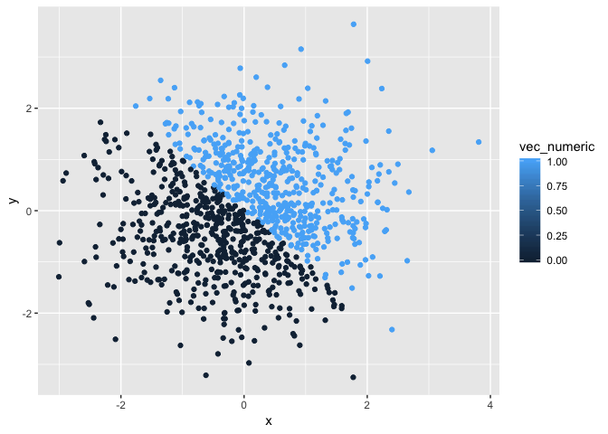

P8105\_HW1\_deg2163
================
Diana Ballesteros Gonzalez
2018-09-20

**Problem 1**
=============

``` r
## set the seed to ensure reproducibility
set.seed(123)

## create data frame with four vectors 
problem_one_df = tibble(
  vec_numeric = runif(10, 0, 5), 
  vec_logical = (vec_numeric > 2),
  vec_char = c("My", "name", "is", "Diana", "Ballesteros", "Gonzalez", "and", 
               "I", "love", "tacos"),
  vec_factor = factor(c("red", "orange", "yellow", "green", "blue", "orange", 
                        "purple", "indigo", "black", "grey"))
) 
```

-   The mean for the a random sample of size 10 from a uniform \[0,5\] distribution is 2.8912375. I was able to get a mean value for this vector because it averaged the 10 random numbers that it reproduced.

-   The mean for a logical vector indicating whether elements of the sample are greater than 2 is 0.8. I was able to get a mean value for this vector because it calculated the proportion of true statements out of the 10.

-   The mean of a (length-10) character vector is NA because you cannot take an average of character values.

-   The mean of a (length-10) factor vector is NA because you cannot take an average of categorical variables.

### Explanation for what happens when your run as.numeric with the logical, character, and factor vectors

``` r
##convert logical, character, and factor to numeric

as.numeric(problem_one_df$vec_logical)
as.numeric(problem_one_df$vec_char)
```

    ## Warning: NAs introduced by coercion

``` r
as.numeric(problem_one_df$vec_factor)
```

-   For the logical vector, I had not problem because it converted the true and false statements to numbers where, 0 = False and 1 = True.
-   For the character vector, I received a warning message stating "NAs introduced by coercion."
-   For the factor vector, you get random numbers assigned to each factor.

### Converting from Character to Factor to Numeric

``` r
as.factor(problem_one_df$vec_char)
as.numeric(as.factor(problem_one_df$vec_char))
```

For the conversion of a character to factor to numeric, I was ablw to obtain values that assigned a random number to each string of characters.

### Converting from Character to Factor to Numeric

``` r
as.character(problem_one_df$vec_factor)
as.numeric(as.character(problem_one_df$vec_factor))
```

    ## Warning: NAs introduced by coercion

For the conversion of character to a factor to numeric, I received a warning message because it cannot produce a numeric value for a character vector.

**Problem 2**
=============

``` r
##load the library 
library(tidyverse)
```

``` r
##set the seed to ensure reproducibility 
set.seed(1)

##create a new df for problem two
problem_two_df = tibble(
    x = rnorm(1000),
    y = rnorm(1000), 
    vec_logical = (x + y > 0)
)

##add two columns, numeric and factor vectors
problem_two_df$vec_numeric = as.numeric(problem_two_df$vec_logical)
problem_two_df$vec_factor = as.factor(problem_two_df$vec_logical)
```

-   The size ot the data set is rows = 1000 and columns = 5

-   The mean for the a random sample of size 1000 from a standard normal distribution is -0.0116481.

-   The median for the a random sample of size 1000 from a standard normal distribution is -0.0353242.

-   The proporportion of cases for which the logical vector is TRUE is 0.49.

Creating Scatterplots
---------------------

### Scatterplot of X and Y using the logical variable

``` r
##scatterplot of x and y
ggplot(problem_two_df, aes(x = x, y = y, color = vec_logical)) + geom_point()
```


``` r
ggsave("scatterplot_x_y_logical.pdf")
```

    ## Saving 7 x 5 in image

-   The scatterplot of x and y using the logical variables where blue represents the values when x + y is greater than two. Since we used a logical variable, it makes sense that it automatically assigned the legend to represents all values where x + y &gt; 2 as TRUE in one color. If it did not meet this criteria (i.e., x + y &lt;= 2), the point was FALSE and in a different color.

### Scatterplot X and Y using the numeric variable

``` r
##scatterplot of numeric variables
ggplot(problem_two_df, aes(x = x, y = y, color = vec_numeric)) + geom_point()
```



-   The scatterplot of x and y using the numeric variable shows a gradient of blue colors as the legend. However, the numeric and logic model have the same output, so the scatterplots look exactly the same. The numeric and logic models have the same output because FALSE is automatically assigned a "0" where TRUE is automatically assigned a "1".

### Scatterplot X and Y using the factor variable

``` r
##scatterplot of factor variables
ggplot(problem_two_df, aes(x = x, y = y, color = vec_factor)) + geom_point()
```


-   Similarily, the scatterplot of x and y using the factor variables will display the same scatterplot as with the logic variable because the vector contains a set of numeric codes with character-valued levels, which are TRUE and FAlSE. Although the TRUE and FALSE legend truly represent "1" and "0," respectively.
